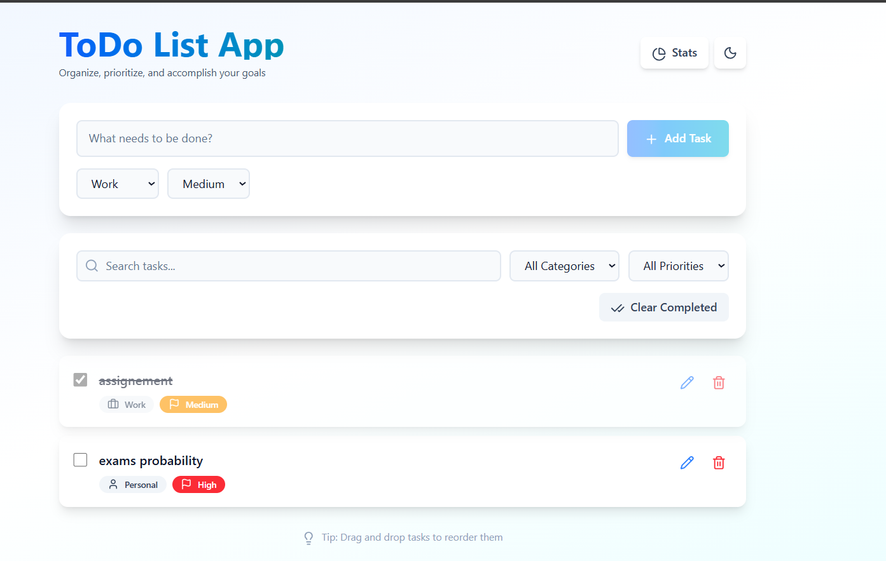
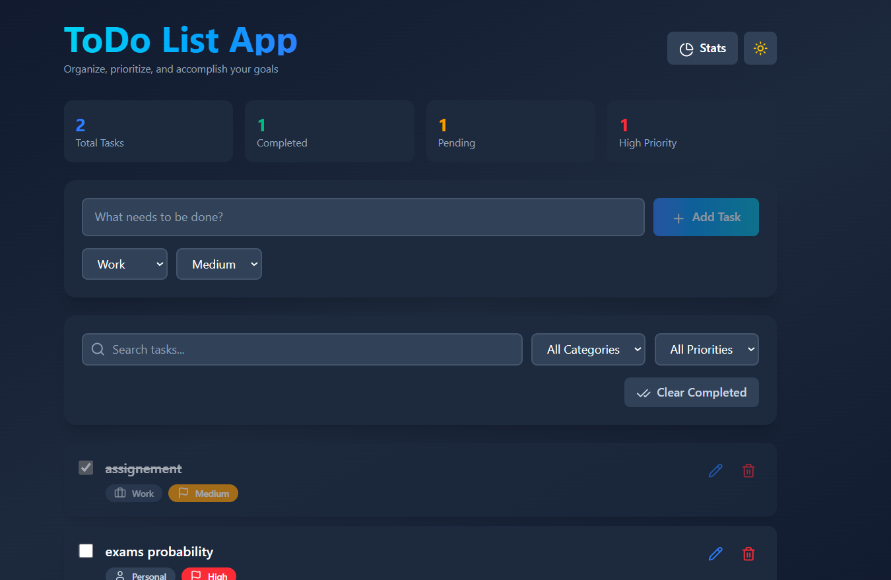
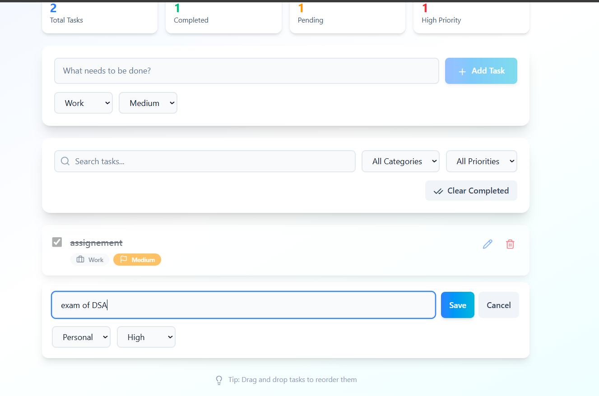
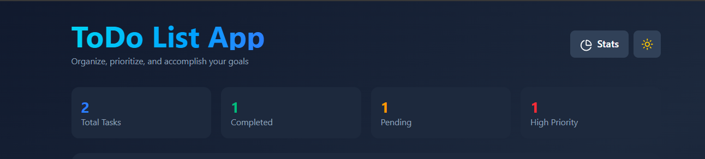

# To-Do List Application


TODO APP Pro is a modern, interactive **To-Do List web application** built with **React** and **Tailwind CSS**.  
It allows users to create, edit, delete, and reorder tasks seamlessly using drag-and-drop functionality.  
The app features a clean, responsive design with **dark mode support**, **task categories**, **priorities**, **completion status**, and **localStorage persistence** for a robust user experience.

## Features

- **Add Task** – Add tasks through an input field and button. Empty inputs are rejected.
- **Edit Task** – Edit text, category, or priority with a clean modal form.
- **Delete Task** – Remove any task instantly.
- **Reorder Tasks (Drag & Drop)** – Smoothly drag and drop tasks to reorder with animations.
- **Display Tasks** – View tasks in a structured list showing category, priority, and completion status.
- **LocalStorage Persistence** – Tasks and theme preferences are saved automatically.
- **Task Completion** – Mark tasks as done with strike-through styling.
- **Categories & Priorities** – Assign tasks to categories (Work, Personal, School) with color-coded badges.
- **Search & Filter** – Quickly locate tasks using the search bar or filters.
- **Dark Mode** – Toggle between light/dark themes with saved preferences.
- **Task Statistics** – View total, completed, pending, and high-priority tasks.
- **Responsive Design** – Works beautifully on desktop, tablet, and mobile.
- **Smooth Animations** – Enjoy transitions, hover effects, and drag animations.

---

## 🛠️ Tech Stack
- **Frontend**: React (JavaScript)
- **Styling**: Tailwind CSS
- **Icons**: Lucide React
- **Storage**: localStorage

---

## ⚙️ Installation

1. **Clone the Repository**
   ```bash
   git clone https://github.com/Iris-Ghislaine/to-do-app-in-reactJS
   cd to-do-app-in-reactJS
````

2. **Install Dependencies**

   ```bash
   npm install
   ```

3. **Install Lucide Icons**

   ```bash
   npm install lucide-react
   ```

4. **Start the Development Server**

   ```bash
   npm start
   ```

   Open the app on port `http://localhost:5173/` or the one appear in your browser

---

## Usage

1. **Add a Task**

   * Enter a description.
   * Choose a category and priority.
   * Click **Add Task** or press **Enter**.

2. **Edit a Task**

   * Click the ✏️ icon.
   * Update text, category, or priority.
   * Click **Save** or press **Enter**.

3. **Delete a Task**

   * Click the 🗑️ icon to remove it.

4. **Mark as Complete**

   * Check the box next to a task.

5. **Reorder Tasks**

   * Drag and drop tasks to reorder them.

6. **Search & Filter**

   * Use the search bar or dropdown filters.

7. **View Stats**

   * Click **Stats** to view task summary.

8. **Toggle Dark Mode**

   * Click 🌙 or ☀️ to change theme.

9. **Clear Completed**

   * Click **Clear Completed** to remove done tasks.

---

## Project Structure

```
TODO-APP/
├── public/
│   ├── screenshots # folder containing these images in readme file
│
├── src/
│   ├── App.jsx          # Main component with full functionality
│   ├── index.js         # Entry point
│   └── index.css        # Tailwind setup
├── package.json
├── tailwind.config.js   # Tailwind configuration
└── README.md            # This file
```

## Screenshots

* Light Mode Overview

* Dark Mode Overview

* Edit Task Modal

* Task Statistics Panel

